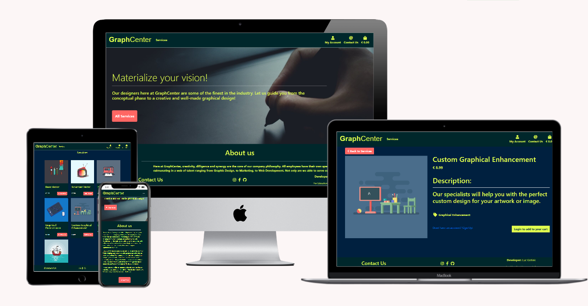

# GraphCenter

[Link to website](https://https://graphcenter.herokuapp.com/)
## Mission:

The mission of GraphCenter is to make their services as accessible as possible, both great projects and small assingments alike. This website allows them to show customers what
typical services they can easily provide aswell as maintaining a clear line of communication. What we would like to bring is a clear picture of the cost for single assignments and
make it easy to purchase them. With back and forth communication we would like to help you make your business endeavours a success! 

### Target Audience:
* Age : 20-50 year olds
* Self-Employed Entrepeneurs
* Project leaders in bigger firms
* Marketing directors
* Self-employed Web-developers
* Private Citizens with an interest in Graphical design for their personal projects

## Welcoming the User
GraphCenter aims to keep it's User Experience engaging. With strong colours on eachother like Yellow, Purple and Black, we hope to keep the senses hooked.
Here is how we keep it simple:

#### As a customer, I would like to easily navigate all the services possible.

#### As a customer, I would like to easily contact the people at GraphCenter.

#### As a customer, I would like to see every service in detail

#### As a customer I would like to add services and store them, so I can leave the website and come back with my memory stored

#### As a customer, I would like to have a a good overview of what I want to buy and how much it would cost.

#### As a customer, I would find it important that my order is confirmed by email.

#### As a customer, I would like to give my billing information before I start looking for services to purchase.

#### As a customer, I would like to save my billing information after a purchase for when I return.

#### As a customer, I would like to view my order history and see all the orders I have made.

#### As a Graphcenter Employee, I would like to easily find the orders that customers made.

#### As a Graphcenter Employee, I would like to direct contact that customers made with us, aswell as the information to reply.

#### As a Graphcenter Employee, I would like to have safeguards if we have an error in our form.

#### As a Graphcenter Employee, I would like to be able to add/update/delete orders in an easy manner.

#### As a Graphcenter Employee, I would like to be able to add/update/delete services in an easy manner.

#### As a Graphcenter Employee, I would like to be able to find images users sent.

#### As a Graphcenter Employee, I would like to be able to find images users sent.

## Features

* __Register/login:__ User is able to login or register the moment they enter the website
* __Contact:__ Allows the User to directly contact GraphCenter.
* __Get_All_Services:__ Gets all the Services
* __Get_Service_By_Category:__ Gets the Services based on Category
* __Service_detail:__ Gets the full information of a service and allows people to add to cart.
* __Add_to_cart:__ Allows users to store information in a 'cart' to return to later
* __Create_Profile:__ Automatically done when registering, allows the user to fill it in.
* __Check_Order_History:__ Allows the user to view all the services he has made in the past.
* __Go_To_Checkout:__ Allows user to go to the checkout page and take their bag with them
* __Pay_with_CC:__ Allows the user to pay for the service, online and secure, via stripe
* __Add_file:__ Allows the user to add a file to the order
* __Add_comment:__ Allows the user to delete an already existing movie, granted they insert the right security code
* __Webhooks:__ Even if customer cancels order halfway, the order will have been put in webhooks and thus secured

### Features Left to Implement

* File on Orderline: File input on line items, 1 file per orderlineitem
* Prior work: Allows people to look at and search through work we as a company have completed
* Comments: Commenting on said private work
* Rating/like: Allowing users to rate graphic design services

### Strategy
The goal of the system is to a create easy-to-use, accesible lay-out so customers know what they can do within a few seconds on the website.
It needs to be flashy so users truly want to get to see what lays ahead.

### Scope
The goal is to make a clear cut path to what the customer might want. Contact us directly? There is a button on the main page. Want to buy services? Sign up and you're ready to go!
This way its also easier for our own employees to understand what is going on and find the way to change services or orders fast and easy.

### Structure
The system is structured to get the right information as quickly as possible. The order of the options provided are placed in a logic workflow while the design provided 
will use a messages bar that should be easy to understand and gives the customer a straight away no-nonsense feedback.
The navbar is available when needed and a footer is provided with a contact-button below the page.

### Skeleton
The Skeleton is quite obvious. The functionality is split up in applications and tend to care for their own templates, models and forms. 
There are crossovers between Profiles, Checkout and services connected by foreign keys. The services themselves are stored in the sessionId 
aswell as the authentication of the user.

### Surface
The colours chosen are yellow, red, black and purple. These colours go well together but make for a powerful look.
The buttons are styled in 2 versions; full red or yellow, to fit the overall design. 

## Technologies

* ### Languages
    * ### [Python](app.py)
    * #### [HTML](index.html)
    * #### [CSS](assets/css/style.css)
    * #### [JavaScript](assets/js/maps.js)
      * Initializing Google Maps and creating functions to create features on Google Maps 
    * #### [Jquery](https://jquery.com/)
      * Navigate the DOM more easily and connects Javascript functions to HTML elements
    * #### [Popper.js](https://popper.js.org/)
      * Needed for CSS dropdowns
* ### Framework
    * #### [Flask](https://flask.palletsprojects.com/en/1.1.x/)
      * Used for running a webapp, templating and many more functionalities
    * #### [PyMongo](https://pymongo.readthedocs.io/en/stable/)
      * Used for interacting with the MongoDB databas
    * #### [Bootstrap](https://getbootstrap.com/)
      * Used for responsive layout and basic styles
* ### Resources
    * ### [MongoDB](https://www.mongodb.com/)
      * Our database, holds all the records
    * ### [Heroku](https://www.Heroku.com/)
      * Hosts our website
    * #### [Google Fonts](https://fonts.google.com/)
       * Font Styles
    * ### [PEP8](http://pep8online.com/)
        * used to check and validate our python code for mistakes, inconsistencies and invalid indentation
    * #### [JSHint](https://jshint.com/)
        * Used to check Javascript code for mistakes, inconsistencies or typo's
    * #### [W3 Validator, HTML](https://validator.w3.org/#validate_by_input)
        * Used to check HTML code for mistakes, inconsistencies or typo's
    * #### [W3 Validator, CSS](https://jigsaw.w3.org/css-validator/)
        * Used to check CSS code for mistakes, inconsistencies or typo's